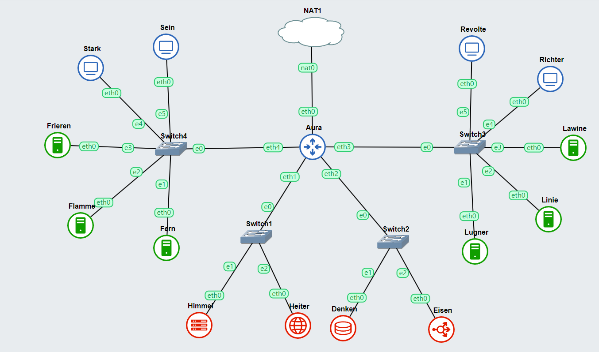

# Jarkom-Modul-3-A11-2023
**Praktikum Jaringan Komputer Modul 3 Tahun 2023**

## Penulis
| Nama | NRP |Github |
|---------------------------|------------|--------|
|Muhammad Zien Zidan | 5025211122 | https://github.com/zienzidan |
|Glenaya | 5025211202 | https://github.com/nyawnayaw05 |

### Topologi


### Config
- **AURA (DHCP Relay)**
```shell
auto eth0
iface eth0 inet dhcp

auto eth1
iface eth1 inet static
	address 192.174.1.0
	netmask 255.255.255.0

auto eth2
iface eth2 inet static
	address 192.174.2.0
	netmask 255.255.255.0

auto eth3
iface eth3 inet static
	address 192.174.3.0
	netmask 255.255.255.0

auto eth4
iface eth4 inet static
	address 192.174.4.0
	netmask 255.255.255.0
```

- **HIMMEL (DHCP Server)**
```shell
auto eth0
iface eth0 inet static
	address 192.174.1.1
	netmask 255.255.255.0
	gateway 192.174.1.0
```

- **HEITER (DNS Server)**
```shell
auto eth0
iface eth0 inet static
	address 192.174.1.2
	netmask 255.255.255.0
	gateway 192.174.1.0
```

- **DENKEN (Database Server)**
```shell
auto eth0
iface eth0 inet static
	address 192.174.2.1
	netmask 255.255.255.0
	gateway 192.174.2.0
```

- **EISEN (Load Balancer)**
```shell
auto eth0
iface eth0 inet static
	address 192.174.2.2
	netmask 255.255.255.0
	gateway 192.174.2.0
```

- **FRIEREN (Laravel Worker)**
```shell
auto eth0
iface eth0 inet static
	address 192.174.4.3
	netmask 255.255.255.0
	gateway 192.174.4.0
```

- **FLAMME (Laravel Worker)**
```shell
auto eth0
iface eth0 inet static
	address 192.174.4.2
	netmask 255.255.255.0
	gateway 192.174.4.0
```

- **FERN (Laravel Worker)**
```shell
auto eth0
iface eth0 inet static
	address 192.174.4.1
	netmask 255.255.255.0
	gateway 192.174.4.0
```

- **LAWINE (PHP Worker)**
```shell
auto eth0
iface eth0 inet static
	address 192.174.3.3
	netmask 255.255.255.0
	gateway 192.174.3.0
```

- **LINIE (PHP Worker)**
```shell
auto eth0
iface eth0 inet static
	address 192.174.3.2
	netmask 255.255.255.0
	gateway 192.174.3.0
```

- **LUGNER (PHP Worker)**
```shell
auto eth0
iface eth0 inet static
	address 192.174.3.1
	netmask 255.255.255.0
	gateway 192.174.3.0
```

- **REVOLTE, RITCHTER, SEIN, STARK (Client)**
```shell
auto eth0
iface eth0 inet dhcp
```