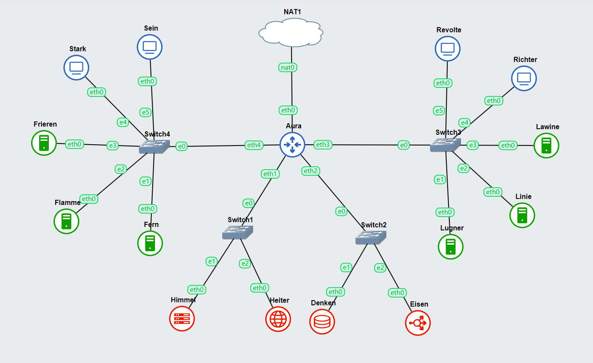
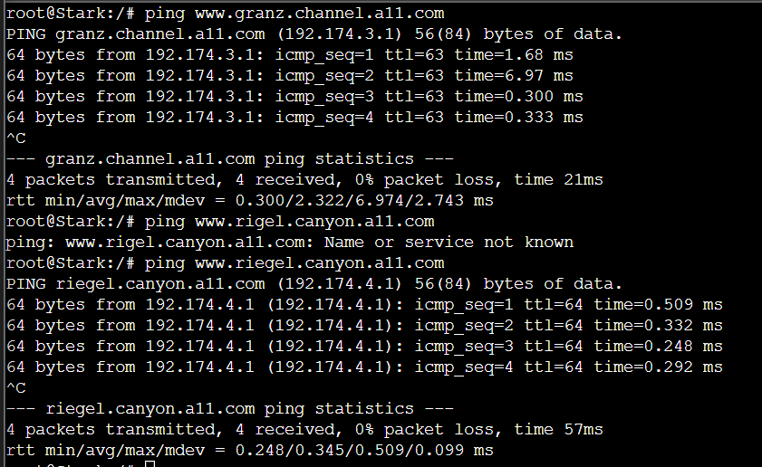

# Jarkom-Modul-3-A11-2023
**Praktikum Jaringan Komputer Modul 3 Tahun 2023**

## Penulis
| Nama | NRP |Github |
|---------------------------|------------|--------|
|Muhammad Zien Zidan | 5025211122 | https://github.com/zienzidan |
|Glenaya | 5025211202 | https://github.com/nyawnayaw05 |

### Topologi


### Configurasi
- **AURA (DHCP Relay)**
```shell
auto eth0
iface eth0 inet dhcp

auto eth1
iface eth1 inet static
	address 192.174.1.0
	netmask 255.255.255.0

auto eth2
iface eth2 inet static
	address 192.174.2.0
	netmask 255.255.255.0

auto eth3
iface eth3 inet static
	address 192.174.3.0
	netmask 255.255.255.0

auto eth4
iface eth4 inet static
	address 192.174.4.0
	netmask 255.255.255.0
```

- **HIMMEL (DHCP Server)**
```shell
auto eth0
iface eth0 inet static
	address 192.174.1.1
	netmask 255.255.255.0
	gateway 192.174.1.0
```

- **HEITER (DNS Server)**
```shell
auto eth0
iface eth0 inet static
	address 192.174.1.2
	netmask 255.255.255.0
	gateway 192.174.1.0
```

- **DENKEN (Database Server)**
```shell
auto eth0
iface eth0 inet static
	address 192.174.2.1
	netmask 255.255.255.0
	gateway 192.174.2.0
```

- **EISEN (Load Balancer)**
```shell
auto eth0
iface eth0 inet static
	address 192.174.2.2
	netmask 255.255.255.0
	gateway 192.174.2.0
```

- **FRIEREN (Laravel Worker)**
```shell
auto eth0
iface eth0 inet static
	address 192.174.4.3
	netmask 255.255.255.0
	gateway 192.174.4.0
```

- **FLAMME (Laravel Worker)**
```shell
auto eth0
iface eth0 inet static
	address 192.174.4.2
	netmask 255.255.255.0
	gateway 192.174.4.0
```

- **FERN (Laravel Worker)**
```shell
auto eth0
iface eth0 inet static
	address 192.174.4.1
	netmask 255.255.255.0
	gateway 192.174.4.0
```

- **LAWINE (PHP Worker)**
```shell
auto eth0
iface eth0 inet static
	address 192.174.3.3
	netmask 255.255.255.0
	gateway 192.174.3.0
```

- **LINIE (PHP Worker)**
```shell
auto eth0
iface eth0 inet static
	address 192.174.3.2
	netmask 255.255.255.0
	gateway 192.174.3.0
```

- **LUGNER (PHP Worker)**
```shell
auto eth0
iface eth0 inet static
	address 192.174.3.1
	netmask 255.255.255.0
	gateway 192.174.3.0
```

- **REVOLTE, RITCHTER, SEIN, STARK (Client)**
```shell
auto eth0
iface eth0 inet dhcp
```

### Soal 1
> Lakukan konfigurasi sesuai dengan peta yang sudah dieberikan. 

Pada Heiter lakukan seperti di bawah ini terlebih dahulu

```shell
echo nameserver 192.168.122.1 > /etc/resolv.conf
apt-get update 
apt-get install bind9 -y 
```

Kemudian pada ```/etc/bind/named.conf.options``` tambahkan :
```shell
options {
    directory "/var/cache/bind";
forwarders {
    192.168.122.1;
    };
 //dnssec-validation auto;
allow-query{any;};
auth-nxdomain no; 
listen-on-v6 { any; }
```
Lalu lakukan ```service bind9 restart```

Selanjutnya pada file ```etc/bind/named.conf.local``` tambahkan :

```shell
zone "granz.channel.a11.com" {
	type master;
	file "/etc/bind/jarkom/granz.channel.a11";
};
zone "riegel.canyon.a11.com" {
	type master;
	file "/etc/bind/jarkom/riegel.canyon.a11";
};
```

Kemudian buat file baru menggunakan ```mkdir /etc/bind/jarkom``` lalu copy isi ```db.local``` dengan cara 
```shell
cp /etc/bind/db.local /etc/bind/jarkom/riegel.canyon.a11.com
cp /etc/bind/db.local /etc/bind/jarkom/granz.channel.a11.com
```

Lalu pada ```/etc/bind/jarkom/riegel.canyon.a11``` isi dengan :

```shell
;
; BIND data file for local loopback interface
;
$TTL    604800
@       IN      SOA     riegel.canyon.a11.com. 	root.riegel.canyon.a11.com. (
                     		2         ; Serial
                         604800         ; Refresh
                          86400         ; Retry
                        2419200         ; Expire
                         604800 )       ; Negative Cache TTL
;
@       	IN      	NS      	riegel.canyon.a11.com. 
@       	IN      	A		192.174.4.1 // IP FREN
www	IN	CNAME	riegel.canyon.a11.com.
```
Selanjutnya pada ```/etc/bind/jarkom/granz.channel.a11.com``` isi dengan :
```shell
;
; BIND data file for local loopback interface
;
$TTL    604800
@       IN      SOA    granz.channel.a11.com. 	root.granz.channel.a11.com. (
                     		2         ; Serial
                         604800         ; Refresh
                          86400         ; Retry
                        2419200         ; Expire
                         604800 )       ; Negative Cache TTL
;
@       	IN      	NS      	granz.channel.a11.com. 
@       	IN      	A		192.174.3.1 //IP Lugner
www	IN	CNAME	granz.channel.a11.com.
```

Kemudian lakukan ```service bind9 start```

**Hasil**


### Soal 2
> Client yang melalui Switch3 mendapatkan range IP dari [prefix IP].3.16 - [prefix IP].3.32 dan [prefix IP].3.64 - [prefix IP].3.80

Pada Himmel (DHCP Server) lakukan hal ini terlebih dahulu :
```shell
echo 'nameserver 192.168.122.1' > /etc/resolv.conf
apt-get update
apt-get install isc-dhcp-server
dhcpd --version
```
Kemudian pada ```/etc/default/isc-dhcp-server``` tambahkan
```shell 
INTERFACESv4="eth0"
```

Lalu pada ``` etc/dhcp/dhcpd.conf``` tambahkan :
```shell
subnet 192.174.1.0 netmask 255.255.255.0{
}

subnet 192.174.2.0 netmask 255.255.255.0{
}

subnet 192.174.3.0 netmask 255.255.255.0{
        range 192.174.3.16 192.174.3.32;
        range 192.174.3.64 192.174.3.80;
        option routers 192.174.3.0;
}
```

Kemudian restart DHCP Server menggunakan ```service isc-dhcp-server restart```

### Soal 3
>Client yang melalui Switch4 mendapatkan range IP dari [prefix IP].4.12 - [prefix IP].4.20 dan [prefix IP].4.160 - [prefix IP].4.168

Kita melanjutkan dari soal nomor 2 yaitu menambahkan konfigurasi baru untuk Switch4 sehingga script akan menjadi seperti di bawah ini :
```shell
subnet 192.174.1.0 netmask 255.255.255.0{
}

subnet 192.174.2.0 netmask 255.255.255.0{
}

subnet 192.174.3.0 netmask 255.255.255.0{
        range 192.174.3.16 192.174.3.32;
        range 192.174.3.64 192.174.3.80;
        option routers 192.174.3.0;
        option broadcast-address 192.174.3.255;
}

subnet 192.174.4.0 netmask 255.255.255.0{
        range 192.174.4.12 192.174.4.20;
        range 192.174.4.160 192.174.4.168;
        option routers 192.174.4.0;
}
```

### Soal 4
> Client mendapatkan DNS dari Heiter dan dapat terhubung dengan internet melalui DNS tersebut

Menambahkan konfigurasi ```option broadcast-address``` dan ```option domain-name-server``` pada Himmel yang terdapat di nomor 2 dan 3. Sehingga menjadi seperti di bawah ini :
```shell
subnet 192.174.1.0 netmask 255.255.255.0{
}

subnet 192.174.2.0 netmask 255.255.255.0{
}

subnet 192.174.3.0 netmask 255.255.255.0{
        range 192.174.3.16 192.174.3.32;
        range 192.174.3.64 192.174.3.80;
        option routers 192.174.3.0;
        option broadcast-address 192.174.3.255;
        option domain-name-servers 192.174.1.2;
        default-lease-time 180;
        max-lease-time 5760;
}

subnet 192.174.4.0 netmask 255.255.255.0{
        range 192.174.4.12 192.174.4.20;
        range 192.174.4.160 192.174.4.168;
        option routers 192.174.4.0;
        option broadcast-address 192.174.4.255;
        option domain-name-servers 192.174.1.2;
        default-lease-time 720;
        max-lease-time 5760;
}
```
Jangan lupa lakukan restart dengan cara ```service isc-dhcp-server restart```

Kemudian pada Aura (DHCP Relay) lakukan ini terlebih dahulu
```shell
echo 'nameserver 192.168.122.1' > /etc/resolv.conf
iptables -t nat -A POSTROUTING -o eth0 -j MASQUERADE -s 192.174.0.0/16
apt-get update
apt-get install isc-dhcp-relay -y
service isc-dhcp-relay start
```

Lalu pada ```/etc/default/isc-dhcp-relay``` tambahkan :
```shell
SERVERS=”192.174.1.1"
INTERFACES="eth1 eth2 eth3 eth4"
OPTIONS=
```

Selanjutnya pada ```/etc/sysctl.conf``` tambahkan 
```shell
net.ipv4.ip_forward=1
```

Kemudian restart dengan menggunakan ```service isc-dhcp-relay restart```

**Hasil**
Merupakan hasil percobaan di client ```Stark```
